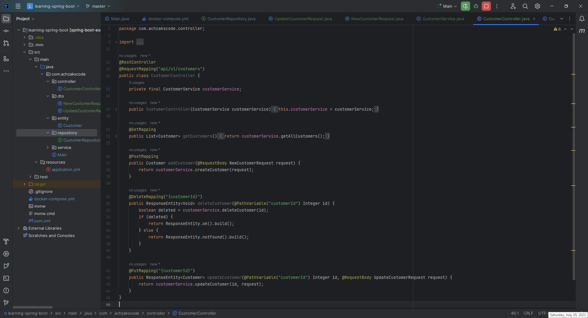
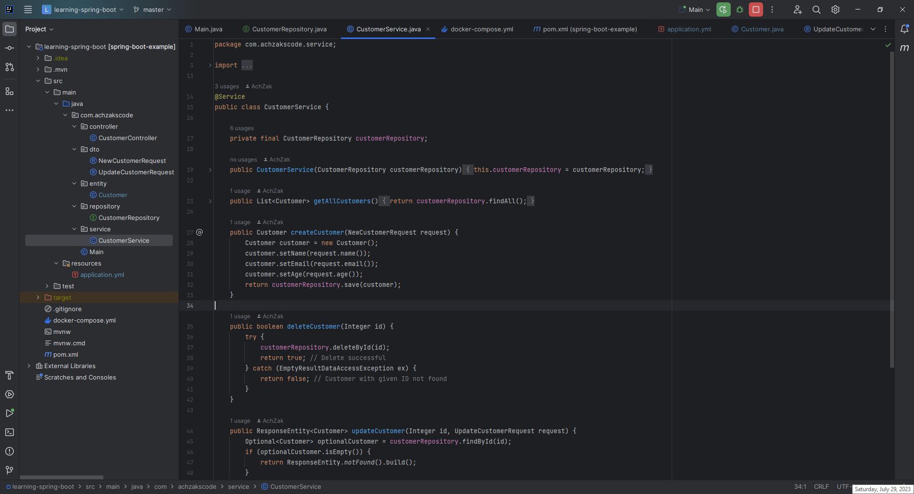
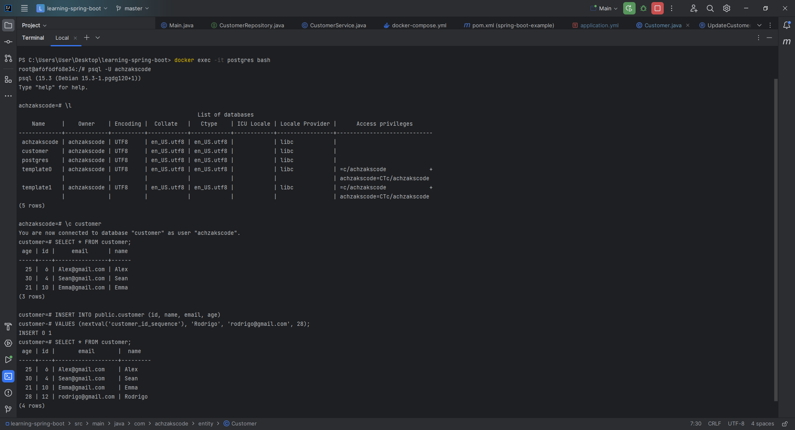
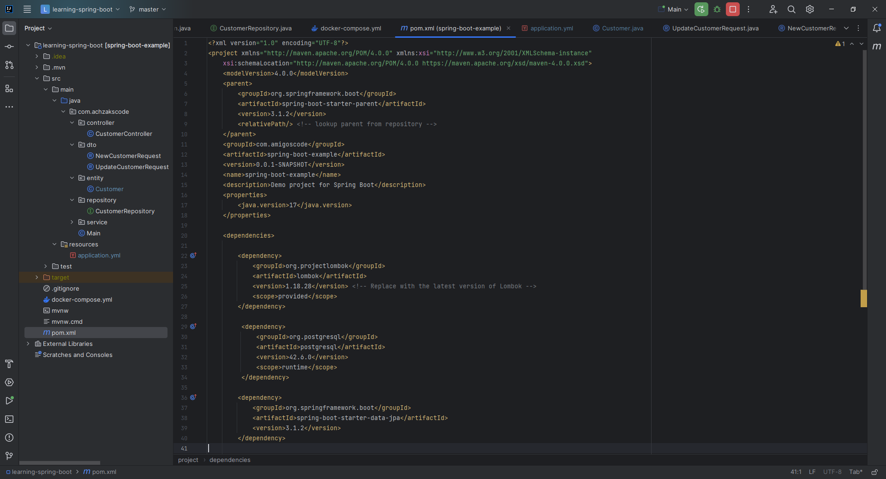
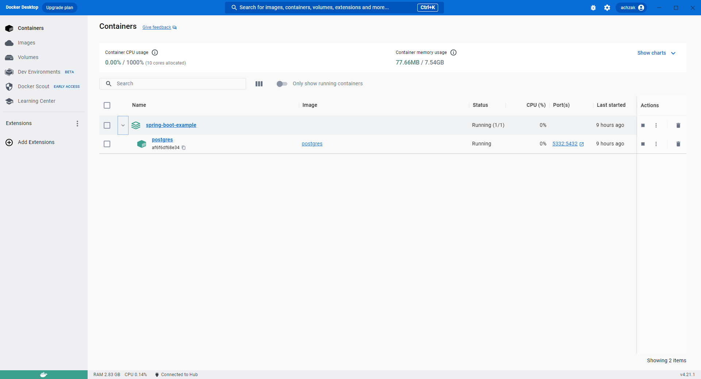
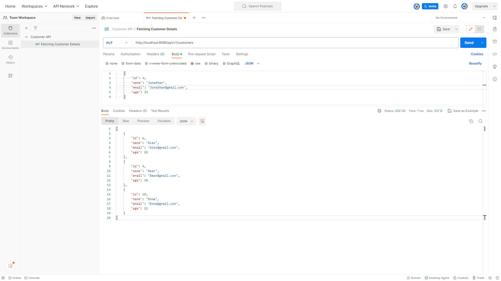
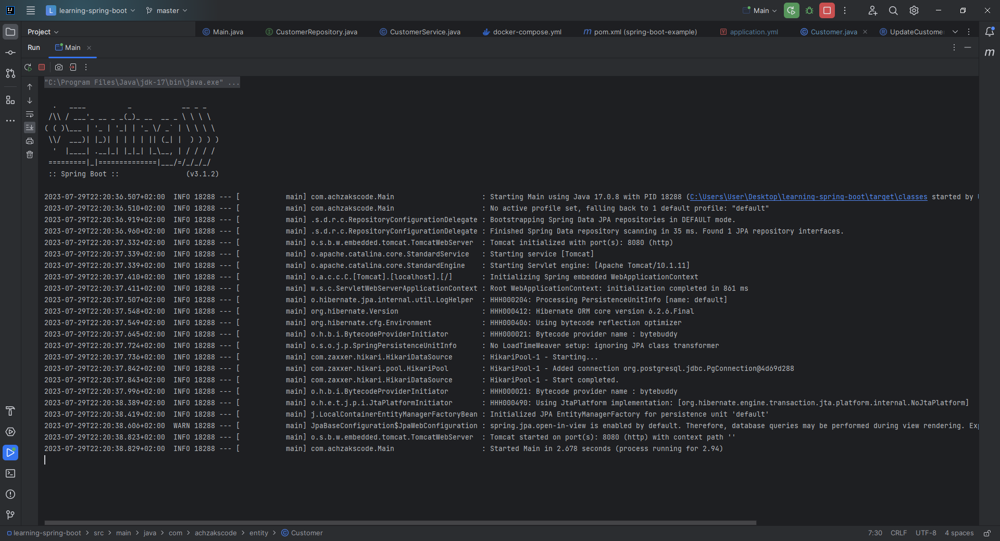
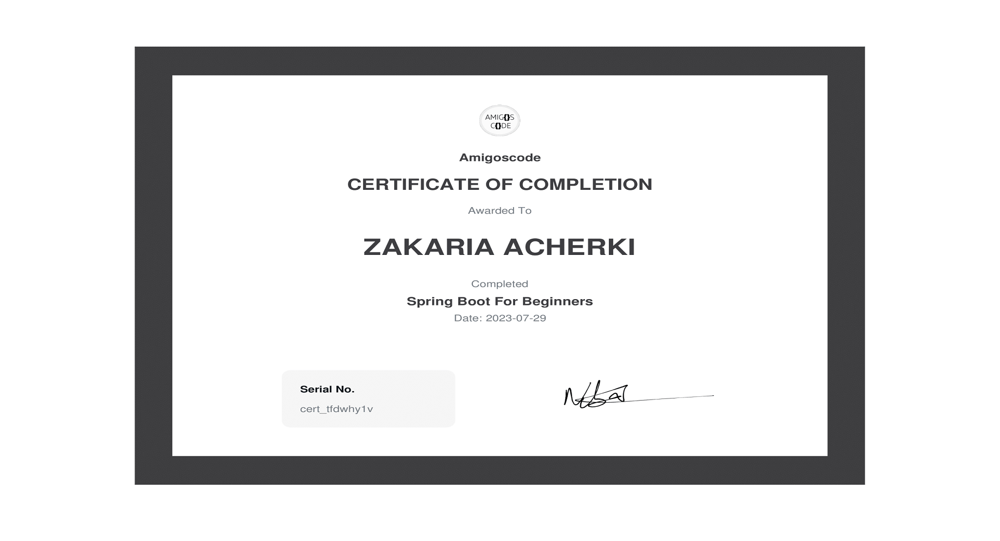

# Learning Spring Boot :books:

Welcome to the "Learning Spring Boot" repository! This project serves as a showcase of my journey into becoming a Java software developer, where I explore and implement various fundamental concepts of Spring Boot. :mortar_board:

## :star2: Features

- Implemented a Spring Boot application using N-tier architecture, with proper package structure and classes following industry best practices.
- Structured the application into distinct layers, including the Controller layer for handling incoming HTTP requests, the Service layer for business logic and data manipulation, and the Repository layer for interacting with the PostgreSQL database.
- Configured Docker to manage a PostgreSQL database and containerize the application for easy deployment.
- Utilized Spring Data JPA and Hibernate to interact with the PostgreSQL database.
- Created RESTful APIs for basic CRUD (Create, Read, Update, Delete) operations on the "Customer" entity.
- Utilized Postman for testing the RESTful APIs and ensuring the proper functionality of the endpoints.
- Demonstrated proficiency in Java SE 17 and JDK 17 syntax and leveraged Lombok for cleaner code.

## :clipboard: Prerequisites

To run this application locally, make sure you have the following software installed:

- Java Development Kit (JDK) 17 :coffee:
- Apache Maven :books:
- Docker Desktop with Docker Engine 24.0.2 or higher :whale:

## :rocket: Getting Started

1. Clone this repository to your local machine.
2. Ensure you have the necessary dependencies installed:
   - IntelliJ IDEA will automatically handle the Maven dependencies for you. :bulb:
   - If you prefer using the terminal, you can run `mvn clean install`.
3. Start Docker Desktop and run the provided `docker-compose.yml` file to set up the PostgreSQL database.
4. Navigate to the project root directory and execute the following command to build and run the application:
   - Using IntelliJ IDEA: Simply click on the "Run" or "Debug" button to build and run the project. :computer:
   - Using the terminal: Run `mvn spring-boot:run`.
5. Once the application is running, you can access the API endpoints using Postman or any other REST API client.

## :link: API Endpoints

- **GET** `/api/v1/customers` - Retrieve a list of all customers.
- **POST** `/api/v1/customers` - Create a new customer. (Request Body: NewCustomerRequest)
- **DELETE** `/api/v1/customers/{customerId}` - Delete a customer by ID.
- **PUT** `/api/v1/customers/{customerId}` - Update a customer by ID. (Request Body: UpdateCustomerRequest)

## :raising_hand: Contributions

This project is a personal learning endeavor, but I welcome contributions and feedback. Feel free to open issues for bug reports or suggestions for improvements. :raised_hands:

## :camera_flash: Screenshots
<table align="center">
  <tr>
    <td align="center">CustomerController Class - REST API Endpoints</td>
  </tr>
  <tr>
    <td align="center"></td>
  </tr>
</table>

<table align="center">
  <tr>
    <td align="center">CustomerService Class - Business Logic and Data Manipulation</td>
  </tr>
  <tr>
    <td align="center"></td>
  </tr>
</table>

<table align="center">
  <tr>
    <td align="center">PostgreSQL Commands</td>
  </tr>
  <tr>
    <td align="center"></td>
  </tr>
</table>

<table align="center">
  <tr>
    <td align="center">Maven POM Configuration</td>
  </tr>
  <tr>
    <td align="center"></td>
  </tr>
</table>

<table align="center">
  <tr>
    <td align="center">Docker Desktop Running PostgreSQL</td>
  </tr>
  <tr>
    <td align="center"></td>
  </tr>
</table>

<table align="center">
  <tr>
    <td align="center">Postman API Testing</td>
  </tr>
  <tr>
    <td align="center"></td>
  </tr>
</table>

<table align="center">
  <tr>
    <td align="center">IntelliJ Terminal - Code Execution and Application Running</td>
  </tr>
  <tr>
    <td align="center"></td>
  </tr>
</table>

<table align="center">
  <tr>
    <td align="center">Spring Boot Beginner Certificate - Completed Learning Spring Boot Course</td>
  </tr>
  <tr>
    <td align="center"></td>
  </tr>
</table>
